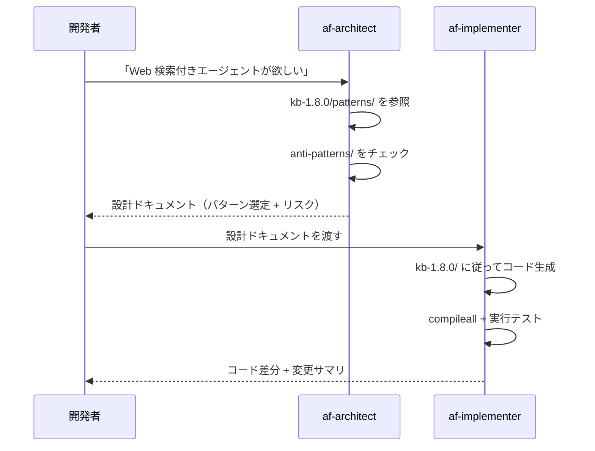

# Lab 1 (Claude Code 版): Claude Code のカスタマイズ機構を理解する

## この Lab の目的

- [Lab 1 (Copilot 版)](01-agent-skills.md) で学ぶ **Custom Instructions** と **Custom Agents** が、Claude Code では何に対応するかを理解する
- このリポジトリに **既に構築済み** の Claude 用アセット ([`.claude/`](../.claude/) と [`CLAUDE.md`](../CLAUDE.md)) を読み解く
- Lab 2 以降で Claude Code を使ってエージェントを構築するときに、これらが「裏側で効いている」ことを意識できるようになる

> [!NOTE]
> この Lab は講師による解説セッションです。Copilot 版 ([`01-agent-skills.md`](01-agent-skills.md)) と内容は対になっています。**Copilot を使う人は Copilot 版、Claude Code を使う人は本ファイル** を読んでください。Lab 2 以降の手順書 (`02`〜`05`) は共通です。

---

## 1-1. 対応関係: Copilot の 2 機構 → Claude Code

[Lab 1 (Copilot 版)](01-agent-skills.md) が教える「Custom Instructions（自動適用）」と「Custom Agents（選択式）」は、Claude Code に 1 対 1 で対応します。**しかもこのリポジトリには既に作成済み** です。

| Copilot の機構 | いつ効くか | Claude Code の対応機能 | このリポジトリでの実体 |
|---|---|---|---|
| Custom Instructions（リポジトリ全体）<br>`.github/copilot-instructions.md` | 常に自動 | `CLAUDE.md`（起動時に自動ロード） | [`CLAUDE.md`](../CLAUDE.md) |
| Custom Instructions（ファイル別）<br>`.github/instructions/*.instructions.md` の `applyTo` glob | 対象ファイルを開いたとき自動 | `CLAUDE.md` の `@import`（`.py` / `.md` を編集するとき該当節を適用） | [`CLAUDE.md`](../CLAUDE.md) が [`python.instructions.md`](../.github/instructions/python.instructions.md) / [`docs.instructions.md`](../.github/instructions/docs.instructions.md) を取り込み |
| Custom Agents（chatmode）<br>`.github/agents/*.agent.md` | ユーザーが選択 | サブエージェント（`@agent-<name>` で明示起動 / Claude が自動委譲） | [`.claude/agents/af-architect.md`](../.claude/agents/af-architect.md) / [`af-implementer.md`](../.claude/agents/af-implementer.md) |
| Prompts<br>`.github/prompts/*.prompt.md` | ユーザーが起動 | スラッシュ コマンド（`/コマンド名`） | [`.claude/commands/`](../.claude/commands/)（3 つ） |

```mermaid
graph TB
    subgraph "自動適用（常に効く）"
        A["CLAUDE.md<br/>リポジトリ全体の既定値 + @import"]
    end

    subgraph "選択式（ユーザーが起動）"
        B[".claude/agents/*.md<br/>サブエージェント"]
        C[".claude/commands/*.md<br/>スラッシュ コマンド"]
    end

    subgraph "知識ベース（参照される）"
        D["kb-1.8.0/<br/>API パターン・アンチパターン"]
    end

    A -->|@import / ポインター| D
    B -->|Required Reading| D
    C -->|参照| D
```

> [!IMPORTANT]
> このリポジトリは **単一ソース ポリシー** を採っています。Claude 用アセットは本文に `@相対パス` を書くことで Copilot 用ファイル (`.github/`) を **そのままインライン展開** します。つまり規約や KB の本体は 1 箇所だけにあり、Copilot 側を更新すれば Claude 側も自動で反映されます。詳細は [`CLAUDE.md`](../CLAUDE.md) と [`.claude/README.md`](../.claude/README.md) を参照してください。

---

## 1-2. Custom Instructions の対応: `CLAUDE.md`

Copilot の Custom Instructions（`.github/copilot-instructions.md` + `.github/instructions/*.instructions.md`）に対応するのが、リポジトリ ルートの [`CLAUDE.md`](../CLAUDE.md) です。

### 仕組み

- Claude Code は起動時にカレント ディレクトリの `CLAUDE.md` を **自動でコンテキストに読み込みます**（Copilot の「常に自動適用」に相当）。
- `CLAUDE.md` / サブエージェント / コマンドの本文に書いた **`@相対パス`** は、Claude Code が **再帰的にインライン展開**します（深度 5）。

このリポジトリの `CLAUDE.md` は、この `@import` を使って Copilot 用ファイルを取り込んでいます。

```text
CLAUDE.md
├── @.github/copilot-instructions.md        ← ワークショップ全体の既定値
├── @.github/instructions/python.instructions.md   ← .py 編集時の規約
└── @.github/instructions/docs.instructions.md     ← .md 編集時の規約
```

### Copilot の `applyTo` glob との違い

| 観点 | Copilot Custom Instructions | Claude Code (`CLAUDE.md`) |
|---|---|---|
| 全体ルールの自動適用 | `.github/copilot-instructions.md` | `CLAUDE.md` 本体 |
| ファイル別ルール | `applyTo: "**/*.py"` で **glob 自動スコープ** | ネイティブな glob 自動切替は **なし**。代わりに `@import` で取り込んだうえで、本文の指示「`.py` を編集するときは以下に従う」に従って Claude が該当節を適用 |
| 知識本体の分離 | instruction はポインター、本体は `kb-1.8.0/` | 同じ（`CLAUDE.md` は `kb-1.8.0/README.md` のルーティング表を引いてから着手するよう指示） |

> [!NOTE]
> Claude Code には Copilot の `applyTo` のような **ファイル glob 単位の自動ロード** はありません。代わりに `CLAUDE.md` が常に効き、そこから `@import` した `.py` / `.md` 規約を、編集対象に応じて Claude が参照します。より厳密にファイル別へ寄せたい場合は、サブディレクトリに `CLAUDE.md` を置く方法もあります（本リポジトリでは未使用）。

---

## 1-3. Custom Agents の対応: サブエージェント (`.claude/agents/`)

Copilot の Custom Agents（chatmode）に対応するのが、Claude Code の **サブエージェント** です。このリポジトリには Copilot の [`.github/agents/`](../.github/agents/) と同一仕様の 2 体が用意されています。

| サブエージェント | 役割 | ツール権限 | source-of-truth |
|---|---|---|---|
| `af-architect` | 要件 → KB 引用付きの設計ドキュメント（コードを書かない） | Read / Grep / Glob | [`af-architect.md`](../.claude/agents/af-architect.md) ← `@.github/agents/af-architect.agent.md` |
| `af-implementer` | 設計 → Python コード（最小差分・KB 準拠・`compileall` 検証） | Read / Edit / Write / Grep / Glob / Bash | [`af-implementer.md`](../.claude/agents/af-implementer.md) ← `@.github/agents/af-implementer.agent.md` |

### フロントマターの対応

Copilot の chatmode と Claude のサブエージェントは、フロントマターのキー名が異なります。

| Copilot chatmode | Claude サブエージェント | 役割 |
|---|---|---|
| `name` | `name` | エージェント ID（kebab-case） |
| `description` | `description` | いつこのエージェントを使うか。Claude が自動委譲を判断する材料にもなる |
| `tools: ["read", "search", "edit", "execute"]` | `tools: Read, Grep, Glob, ...` | 許可ツールのリスト（Claude は実ツール名で指定） |
| `infer: true` | （なし） | Claude は常にワークスペース文脈を参照可能 |

> [!NOTE]
> `tools` は **許可リスト** です。`af-architect` は `Read, Grep, Glob` のみ — Copilot 版と同じく **意図的にコードを書けない設計** です。`af-implementer` は `Edit / Write / Bash` を追加で持ち、実装と `compileall` 検証ができます。

### 起動方法（Claude Code）

Copilot は chatmode dropdown で選択しますが、Claude Code では会話内で `@agent-<name>` とメンションするか、Claude が `description` を見て自動委譲します。

```text
> @agent-af-architect Lab 2 で MCP を使うエージェントの設計を出して

(Claude が af-architect を起動 → 設計ドキュメントを Markdown で出力)

> @agent-af-implementer 上の設計に従って solutions/lab2/src/agent.py を書いて

(Claude が af-implementer を起動 → 最小差分で実装し compileall で検証)
```

### 連携フロー（ハンドオフ）

architect → implementer のハンドオフは Copilot 版とまったく同じです。



---

## 1-4. Prompts の対応: スラッシュ コマンド (`.claude/commands/`)

Copilot の Prompts（`.github/prompts/`）に対応するのが、Claude Code の **スラッシュ コマンド** です。`/コマンド名` で呼び出します。

| コマンド | 用途 | 対応 Lab | source-of-truth |
|---|---|---|---|
| `/deploy-hosted-agent` | `azd ai agent init --deploy-mode code` + `azd up` を案内 | [Lab 3](03-foundry-deploy.md) | [`deploy-hosted-agent.md`](../.claude/commands/deploy-hosted-agent.md) |
| `/add-cloud-evaluation` | Foundry Cloud Evaluation スクリプトを生成 | [Lab 4](04-trace-evaluation.md) | [`add-cloud-evaluation.md`](../.claude/commands/add-cloud-evaluation.md) |
| `/add-mcp-tool` | 既存エージェントに MCP を 1 つ追加 | [Lab 5](05-cicd.md) の前段 | [`add-mcp-tool.md`](../.claude/commands/add-mcp-tool.md) |

> [!TIP]
> これらは Lab 2〜5 を一度手で通した **後** に、同じ作業を素早く繰り返したいときのショートカットです。Lab 1 の学習段階では、まず仕組みを理解することを優先してください。

---

## 1-5. Instructions vs Agents: いつ何を使うか（Claude Code）

| 観点 | `CLAUDE.md`（Instructions 相当） | サブエージェント（Agents 相当） |
|---|---|---|
| 起動方法 | 自動（起動時に常にロード） | `@agent-<name>` で明示、または自動委譲 |
| スコープ | リポジトリ全体（`@import` でファイル別規約も取り込み） | 起動中のみ有効・独立コンテキスト |
| 主な用途 | ルール・規約・知識ポインター | 専門タスク（設計、実装） |
| ツール制限 | なし（通常の Claude 権限） | `tools` で明示的に制限可能 |

**使い分けの判断基準（Copilot 版と同じ）:**

- 「**どのファイルでも常に守ってほしいルール**」→ `CLAUDE.md`
- 「**特定のタスクで専門家として振る舞ってほしい**」→ サブエージェント

---

## 1-6. まとめ

| キーワード | 意味 |
|---|---|
| `CLAUDE.md` | 起動時に自動ロードされる Custom Instructions 相当。`@import` で `.github/` の規約・既定値を再帰展開 |
| `.claude/agents/*.md` | サブエージェント — Copilot chatmode 相当。`@agent-<name>` で起動 |
| `.claude/commands/*.md` | スラッシュ コマンド — Copilot prompts 相当。`/コマンド名` で起動 |
| `@相対パス` | 本文に書くと対象ファイルをインライン展開（単一ソース ポリシーの要） |
| ハンドオフ | `af-architect`（設計）→ `af-implementer`（実装）の受け渡し |

> [!TIP]
> Lab 2 以降では Claude Code に直接コードを生成させます。その際、ここで見た `CLAUDE.md`（Python 規約・API 知識ポインター）が **裏側で常に効いている** ことを意識してください。専門タスクでは `@agent-af-architect` / `@agent-af-implementer` を使い分けられます。

---

次へ → [Lab 2: MAF で Microsoft 最新情報エージェント作成](02-maf-agent.md)
